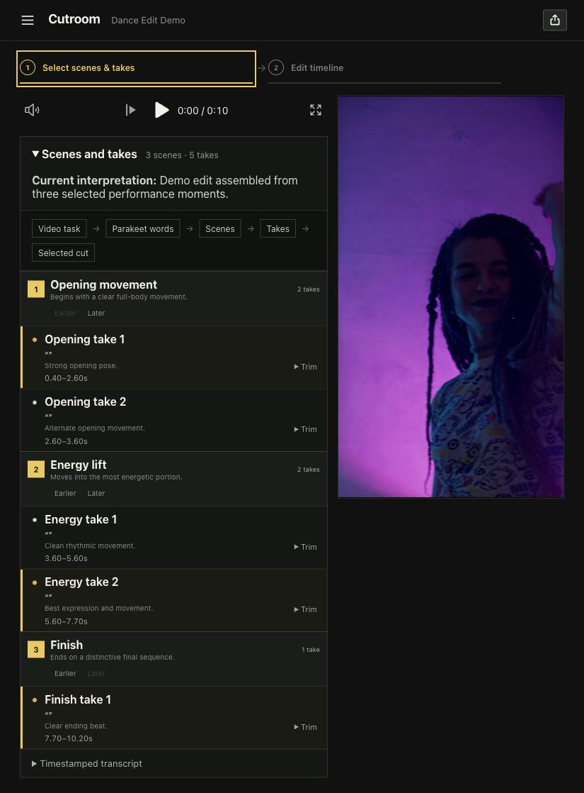

# Cutroom

Cutroom is an experimental, local-first video editor driven by Codex. Record yourself directing the edit and performing each take in a single video; Cutroom interprets the directions, selects and assembles the takes, and gives you a finished video to review.



_Demo footage: [“Vertical Video of a Woman Dancing”](https://www.pexels.com/video/vertical-video-of-a-woman-dancing-5805069/) by Tima Miroshnichenko, used under the [Pexels License](https://www.pexels.com/license/)._

The current build provides:

- a recording-plan view that maps one long source into several new or existing output projects;
- a tall assembled-program filmstrip with compact, time-aligned compositing lanes;
- scene/take selection, source trims, image overlays, subject cutouts, and reference-video clips;
- project-owned JSON state plus CLI and HTTP contracts for headless editing;
- local transcript, pitch, thumbnail, waveform, and export pipelines;
- source-preserving export planning and an explicit TikTok delivery preset.

Cutroom is early software. The project schema, media-analysis results, and export pipeline are owned here; no third-party editor project format is required.

## Requirements

- Node.js 22 or newer
- FFmpeg and FFprobe available on `PATH`
- macOS for the optional loopback host service
- optional local FluidAudio/Parakeet and rembg installations for transcription and subject cutouts

## Run locally

```sh
npm install
npm run check
npm run build
npm run service:start
```

Open `http://127.0.0.1:4173`. A project route is `/project/<project-id>`.

Cutroom does not bundle media or model weights. Project files, raw recordings, source caches, analysis artifacts, models, and exports live under `CUTROOM_RUNTIME_ROOT`; the default is `/Volumes/VanjaOljacaX/Cutroom`. If that storage is unavailable, Cutroom fails clearly instead of falling back to Downloads, `/tmp`, the repository, or a home cache. Set `CUTROOM_RUNTIME_ROOT` explicitly only when developing against another deliberate storage root.

## Headless workflow

Create a project from a source recording:

```sh
npm run video:create -- --source /absolute/path/to/video.mov
```

Inspect the emitted project ID and open its canonical project route. See [VIDEO_TASK.md](VIDEO_TASK.md), [LOCAL_ANALYSIS.md](LOCAL_ANALYSIS.md), and [STITCH_CONTRACT.md](STITCH_CONTRACT.md) for the current CLI, API, analysis, overlay, stitch, and export contracts.

## Architecture boundary

The browser is a view and direct-manipulation surface over validated project state. Codex or another orchestration layer can call the same CLI/API without becoming the storage engine. Downloaded reference media, proxies, thumbnails, waveforms, and generated mattes are regenerable; timeline composition and placement records are durable edit truth.

## License

No license has been granted yet. The source is public for inspection, but reuse rights have not yet been specified.
